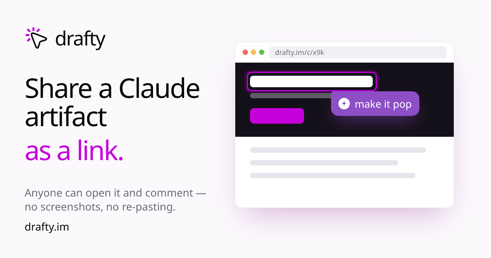

<p align="center">
  
</p>

**Marky** is point-and-comment review for the things Claude makes. Claude writes a plan, a spec, a page — you publish it to a link, then click any line and leave a note, Figma-style. Claude reads the comments and ships a new version on the same link, with history. No screenshots, no re-pasting "the third paragraph, the one about pricing."

**Easiest:** in a Claude Code session, just ask — *"install the marky-im/marky plugin."* Claude runs it for you (you approve the install once, or it's automatic on auto-approve), then run `/reload-plugins` to switch it on live — no restart.

Or do it by hand:

```
/plugin marketplace add marky-im/marky
/plugin install marky@marky-im
/reload-plugins
```

`/reload-plugins` activates everything live in the current session — the `marky` skill and the `marky` command on PATH, no restart. (Requires [bun](https://bun.sh).)

## How it works

Once installed, just tell Claude to **"marky it"** after it writes something:

1. Claude runs `marky push <file>` and hands you a `marky.im/canvas/<slug>` link.
2. Open it. Hover any element, click, leave a comment. Share the link — anyone comments as a guest, no sign-up, live cursors.
3. Tell Claude "address the canvas" (or set it live) — it reads each thread, edits the source, and pushes a new version on the same link. Old versions are kept.

You talk; Claude runs the commands. You never touch the CLI yourself.

## What's in the box

- **The `marky` skill** — teaches Claude the whole loop: publish, read comments, reply on the canvas, mark threads done, push revisions, roll back. Claude loads it on its own when you say "marky it" / "share this for feedback" / "what did they comment".
- **The `marky` CLI** — a thin HTTP client (no keys — it starts as a persistent guest stored in `~/.marky`, and `marky login` opens your browser to sign in, one sign-in covering web + CLI, when you want to keep canvases). `push`, `watch`, `inbox`, `reply`, `resolve`, `mode`, `claim`, and the rest.

## Modes

A canvas has one **mode**, and Claude sets it from how you talk:

| Mode | Viewers comment | Claude acts on comments |
|---|---|---|
| `readonly` | no | — |
| `feedback` *(default)* | yes | no — parked until you say go |
| `live` | yes | yes — works them as they arrive |

"Go live" arms a realtime doorbell so Claude reacts the moment you comment; "park it" stops it.

## Privacy & telemetry

The CLI starts as an anonymous guest — no account, no email — until you choose to `marky login` (which opens your browser) to keep canvases under a real account. It sends basic usage events (e.g. `canvas.published`) to marky.im so I can see what's used; set `MARKY_NO_ANALYTICS=1` to turn that off. It only ever talks to `marky.im` (override with `MARKY_BASE_URL`).

## Links

- The product: **[marky.im](https://marky.im)**
- Agent quickstart (no install, demo only): [marky.im/get](https://marky.im/get)

MIT licensed.
